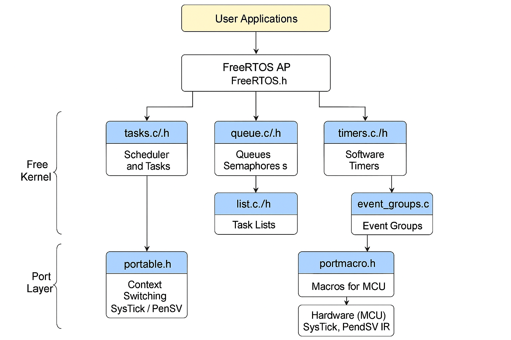

# **FreeRTOS Files Overview**

## **1. Core and Base Files**
- **`FreeRTOS.h`** – The main FreeRTOS header file; it includes configuration and other headers.
- **`tasks.c` / `task.h`** – Implements the task scheduler and task API (create, delete, delay, etc.).
- **`timers.c` / `timers.h`** – Implements software timers.
- **`queue.c` / `queue.h`** – Implements queues for inter-task communication.
- **`list.c` / `list.h`** – Generic list management used internally by the kernel (ready tasks, blocked tasks, etc.).

---

## **2. Synchronization and IPC**
- **`semphr.h`** – API for semaphores and mutexes (a wrapper around queues).
- **`event_groups.c` / `event_groups.h`** – Event groups for synchronizing multiple tasks.
- **`stream_buffer.c` / `stream_buffer.h`** – Stream buffers (FIFO data transfer).
- **`message_buffer.h`** – Message buffers (wrapper on top of stream buffers).

---

## **3. Portability Layer**
- **`portable.h`** – Selects and includes the correct hardware/compiler port.
- **`portable/`** – Contains the hardware-specific implementation (`port.c`, `portmacro.h`) for each MCU and compiler.
- **`projdefs.h`** – Basic kernel definitions and macros.
- **`stack_macros.h` / `StackMacros.h`** – Low-level stack-related macros for task switching.

---

## **4. MPU and libc Support**
- **`mpu_wrappers.h` / `mpu_prototypes.h` / `mpu_syscall_numbers.h`** – Support for MPU (Memory Protection Unit).
- **`newlib-freertos.h`** – Integration with the newlib C standard library (e.g., `printf`).
- **`picolibc-freertos.h`** – Integration with the Picolibc standard library.

---

## **5. Co-routines (legacy feature)**
- **`croutine.c` / `croutine.h`** – Co-routines (very lightweight tasks, mostly deprecated).

---

## **6. Utility and Documentation**
- **`atomic.h`** – Atomic operations.
- **`deprecated_definitions.h`** – Old/deprecated definitions for backward compatibility.
- **`MISRA.md`** – MISRA C compliance notes.
- **`LICENSE.md` / `README.md`** – License and project documentation.

---

  

